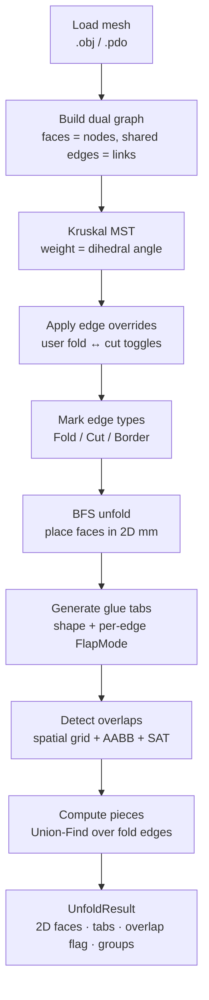
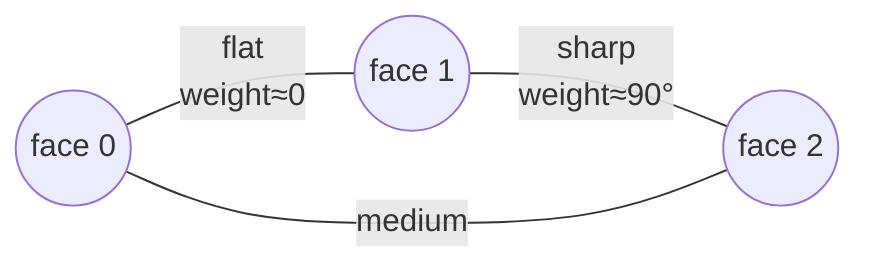
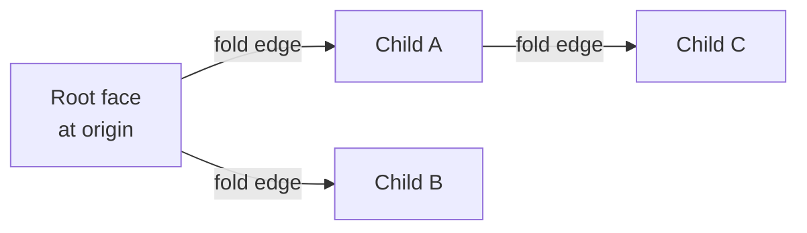

# The Unfold Algorithm

This is the heart of 4H-Unfolder: how a closed 3D mesh becomes a set of flat, non-overlapping
2D pieces with glue tabs. It's the same pipeline on Windows (C#) and macOS (Swift).

---

## The pipeline at a glance

Each stage is explained below.

---

## 1. Build the dual graph

The mesh is triangulated, then inverted into its **dual graph**:

- each **face** becomes a node,
- each **shared edge** between two faces becomes a link between their nodes.

The link's **weight is the dihedral angle** across that edge — how sharply the two faces bend
relative to each other. A near-flat seam has a small weight; a sharp crease has a large one.

---

## 2. Choose seams with Kruskal's MST

We need to decide **which edges stay attached (folds)** and **which get cut**. Cutting *every*
non-tree edge and keeping a spanning tree of folds guarantees the mesh flattens without any
face being attached in two conflicting ways.

**Kruskal's minimum spanning tree** sorts edges by weight (dihedral angle) ascending and adds
each edge that doesn't form a cycle. Because low weight = flat seam, the MST **prefers to keep
flat surfaces attached** and pushes cuts onto the sharp creases — exactly where a papercrafter
would naturally cut. Edges left out of the tree become cut edges.

---

## 3. Apply overrides & classify edges

The user's manual **fold ↔ cut toggles** ([Editing Edges & Flaps](Editing-Edges-and-Flaps))
are applied on top of the MST result. Every edge is then labelled:

- **Fold** — in the (possibly user-adjusted) spanning tree,
- **Cut** — an interior edge not in the tree,
- **Border** — a mesh boundary with no partner face.

The set of fold-edge IDs is what drives the next step.

---

## 4. BFS unfold — placing faces in 2D

Starting from a **root face** laid flat at the origin, a **breadth-first search** walks the fold
tree. For each child face reached across a fold edge, the engine reconstructs the face's third
vertex (`ReconstructApex`) so that the **shared edge keeps its exact 3D length** in 2D. This
preserves every triangle's true size and shape — the paper model matches the digital one.

Disconnected components (from cuts) each get their own root and BFS, producing multiple pieces.

---

## 5. Generate glue tabs

Along cut and border edges, tabs are added so pieces can be glued together. Shape (trapezoid /
rectangle / triangle) and an alternate-flap policy are applied globally, then **per-edge
`FlapMode` overrides** decide which side of a seam carries the tab, both sides, or none. See
[Editing Edges & Flaps → per-edge flap modes](Editing-Edges-and-Flaps#per-edge-flap-modes).

---

## 6. Detect overlaps

A flattened piece can fold back onto itself and self-overlap — impossible to cut as one flat
shape. Detection is a two-phase collision test:

1. **Broad phase — spatial grid.** Each face's axis-aligned bounding box (AABB) is inserted into
   the uniform grid cells it covers; only faces sharing a cell are considered. This replaced an
   O(n²) all-pairs loop and scales to large meshes.
2. **Narrow phase — AABB pre-check, then SAT.** Candidate pairs get a quick bounding-box reject,
   then the **Separating Axis Theorem** confirms a true triangle overlap.

Overlapping pieces are flagged (shown red) so you can [cut or rearrange them](FAQ-and-Troubleshooting#some-pieces-are-red--flagged-as-overlapping).

---

## 7. Compute pieces (Union-Find)

Finally, faces connected by fold edges are grouped into **pieces** using a **Union-Find**
(disjoint-set) pass over the fold edges. Each resulting set is one connected flat piece you can
cut out as a unit.

---

## Output: `UnfoldResult`

The pipeline returns an `UnfoldResult` carrying:

- 2D faces in millimetres (with UV coordinates for texture rendering),
- glue tabs,
- the overlap flag,
- piece groupings.

This feeds the [2D canvas](Quick-Start#2-unfold) and the [SVG/PDF exporters](Export-and-Printing).

---

## Source

| Concern | Windows | macOS |
|---------|---------|-------|
| Unfold engine | `FourHUnfolder.Geometry/UnfoldEngine.cs` | `Sources/.../Services/UnfoldEngine.swift` |
| MST | `KruskalMstBuilder`, `DualGraphBuilder` | (in `UnfoldEngine`) |
| Glue tabs | `GlueTabGenerator.cs` | `GlueTabGenerator.swift` |
